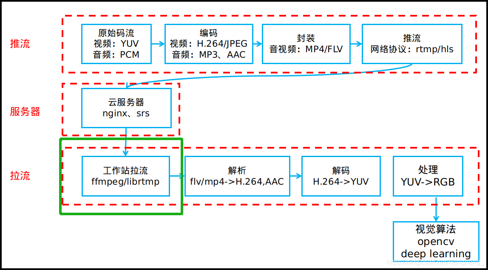
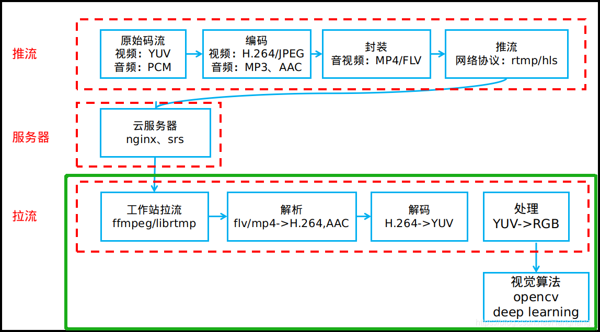
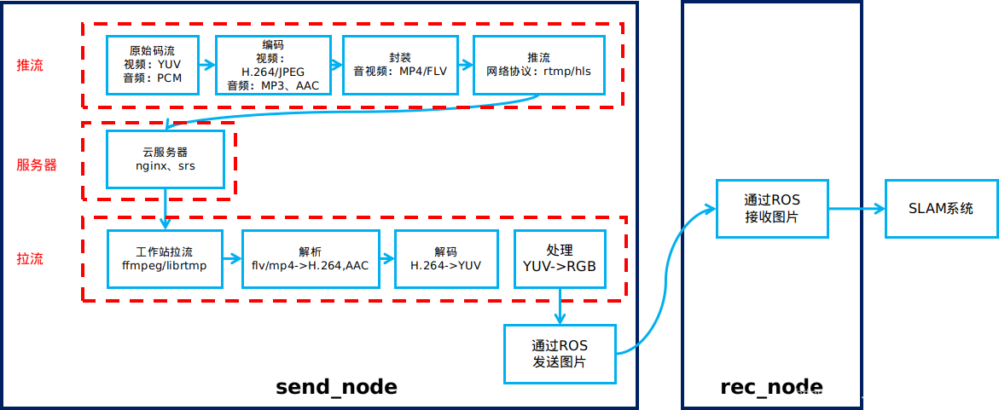
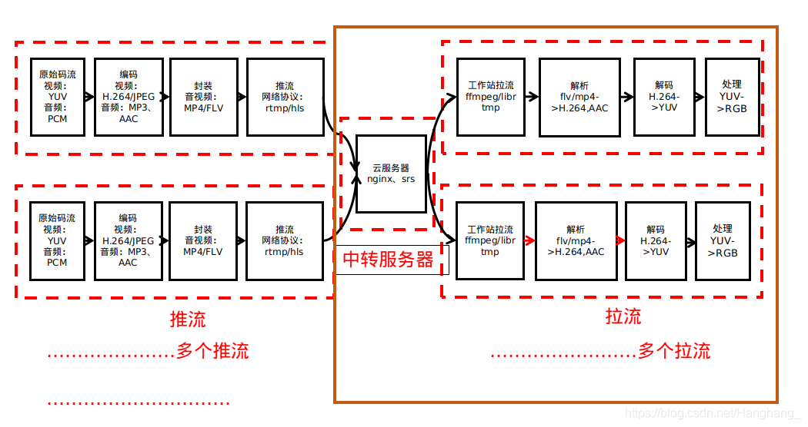

# 流媒体


## 1. **linux下的拉流**


**下图是流媒体标准传输框架，今天我们要实现绿色框部分。**





本篇博客是参考雷神的最简单的基于FFMPEG的推流器附件：收流器，修改API得以运行，并使用cmake方式生成可执行文件，解决了新手都会遇到的undefined reference to问题。

这个demo的功能是从芒果台接收视频流并转成flv格式保存下来，采用的协议是rtmp，停止运行按ctrl+c即可。


## 2. 实现flv解析h.264–>YUV–>RGB


今天我们要实现的是使用ffmpeg+rtmp拉流，拉完的FLV流，提取出H.264视频，再提取出YUV，再提取出rgb图，最后用opencv处理图像。我的任务是得到rgb图像，从而可以对图像进行处理。


整体流程：rtmp拉流–>FLV–>H.264–>YUV–>RGB–>OPENCV处理





## 3 使用nginx搭建本地推流服务


1、部署nginx+nginx-rtmp-module

2、配置nginx的rtmp应用

```
sudo vim /usr/local/nginx/conf/nginx.conf
```

修改nginx.conf，增加rtmp的application


```
rtmp {
	server {
		listen 1935;
		chunk_size 4096;
		application rtmplive {
			live on;
			max_connections 1024;
			allow publish all; # control access privilege
			allow play all; # control access privilege
			}
		}
}

```

其中：
 application的名字为rtmplive；
 最大可连接数为1024；
 chunk_size分开数据大小为4096；
 监听的端口为1935。

启动nginx

```
sudo /usr/local/nginx/sbin/nginx 
```

3、启动ffmpeg推流

```
ffmpeg -re -i sss.mp4 -c copy -f flv  rtmp://localhost:1935/rtmplive 
```

VLC打开网络串流，输入`rtmp://localhost:1935/live/mytv: Input/output error`


## 4 引入ROS系统





原本只有一个main.cpp，现在我们定义一个Transdata类。
所以现在扩展成三个文件：
transdata.cpp
transdata.h
Trans_node.cpp

其中，transdata.cpp里写明类的函数的具体过程，transdata.h用于定义函数名，Trans_node.cpp用于实例化Transdata类，并调用其函数。


## 5. ffmpeg多线程拉流




主程序main.cpp分为两个部分，一是main()函数里申请pthread线程ID，开启线程，释放线程；二是athread线程函数的编写，每一个用户拉的流根据用户ID而定，比如用户ID为1的，拉流地址后面加1。